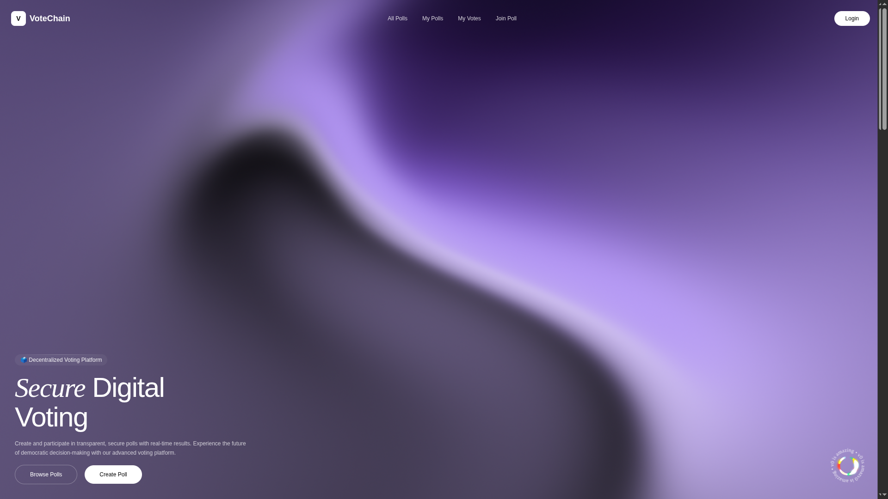
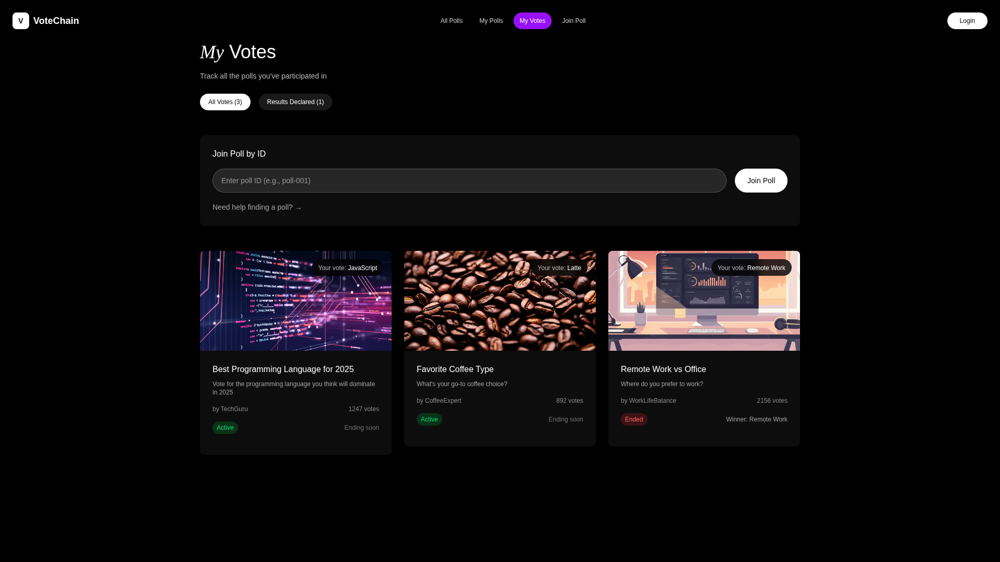
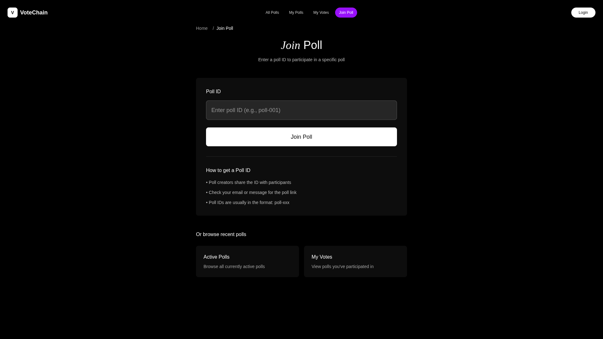
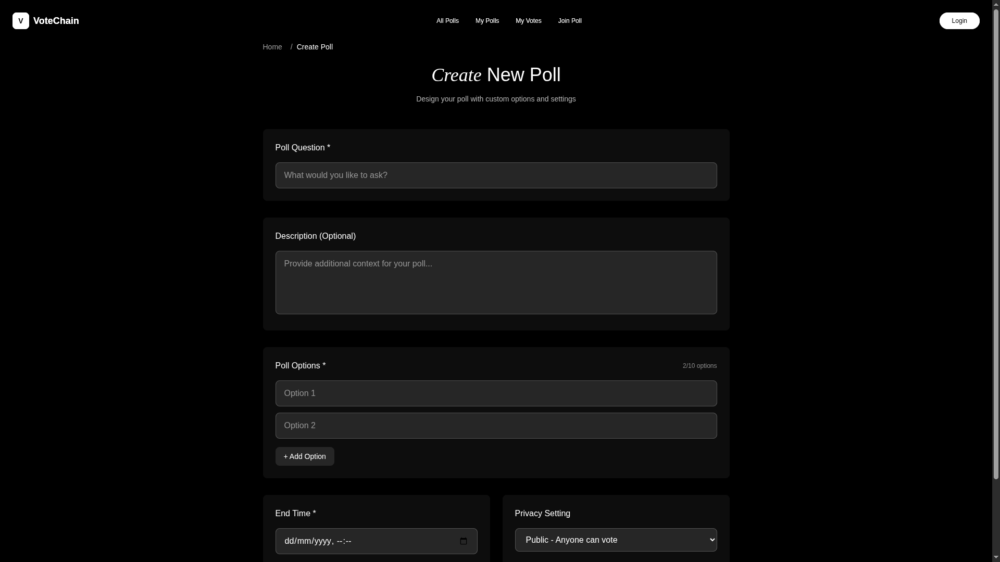

# 🗳️ Decentralized Voting DApp

A **decentralized blockchain-based voting application** built with **Solidity**, enabling **transparent, secure, and verifiable** on-chain polling.  
Users can create or participate in polls with options for **public/private visibility**, ensuring fairness and decentralization without relying on a central authority.

---

## 📸 Application Screenshots

Here are some key screenshots from the Voting DApp:

  
*Home Page*

  
*Public Poll Listing*

  
*Join Poll*

  
*Create Poll*

---

## 🚀 Overview

This DApp allows anyone to connect their **Ethereum wallet (MetaMask)** and:

- Create **public** or **private** polls.
- Vote securely on any available polls.
- Manage their own polls and track results in real time.
- Restrict voting access in **private polls** only to allowed voters.
- View all public polls created by the community.

Every page in the application dynamically **fetches data directly from the blockchain**, ensuring users always see the **most accurate on-chain state**.  
Additionally, the DApp maintains **off-chain data copies** (in MongoDB or another database) for analytics, caching, and improved performance — ensuring both **on-chain transparency** and **off-chain reliability**.

---

## ⚙️ Tech Stack

| Layer | Technology |
|-------|-------------|
| **Smart Contracts** | Solidity, Foundry (Forge, Anvil, Cast) |
| **Frontend** | React (Vite), TailwindCSS, React Router DOM |
| **Blockchain Interaction** | ethers.js, web3.js |
| **Wallet** | MetaMask (Ethereum Sepolia Testnet) |
| **Backend (Optional)** | Node.js / Express.js |
| **Storage** | MongoDB  (for off-chain caching) |

---

## 🧠 Key Features

### 🪙 1. Wallet-Based Login
Users log in using their **Ethereum wallet** (MetaMask).  
No centralized authentication — wallet address is the user identity.

### 🌍 2. Public Polls
- Open for everyone to view and vote.
- Each poll and vote are stored permanently on-chain.

### 🔒 3. Private Polls
- Creator specifies **allowed voter addresses**.
- Only those addresses can participate in voting.
- Provides controlled and restricted access.

### 🗂️ 4. My Polls
- Dashboard showing polls created by the logged-in user.
- Manage, share, and track polls with live updates.

### 🧾 5. My Votes
- Displays all polls where the user has voted.
- View your voting history and results easily.

### 📅 6. Poll Duration
- Each poll has a **start** and **end** time.
- Automatically closes when the timer expires.
- Ensures fair and time-bound participation.

### 🔗 7. Blockchain Transparency
- All votes, poll creation, and ownership are verifiable on-chain.
- No single point of control or manipulation.

### 🧩 8. On-Chain + Off-Chain Data Sync
- Real-time data (polls, votes, results) fetched from blockchain.
- Off-chain database stores metadata and analytics for backup.
- Guarantees both **decentralized integrity** and **centralized efficiency**.

---

## 🛠️ Local Setup

```bash
# Clone repository
git clone https://github.com/<your-username>/<repo-name>.git
cd <repo-name>

# Install frontend dependencies
cd frontend
npm install

# Compile & test smart contracts
forge build
forge test

# Deploy contracts
forge script script/Deploy.s.sol:DeployScript --rpc-url <RPC_URL> --private-key <PRIVATE_KEY> --broadcast

# Run frontend
npm run dev
